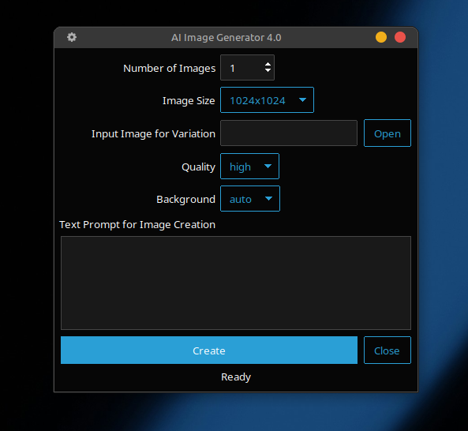

# aimgui
### AI Image generation and variation desktop GUI

It's a Python program for Linux, Mac, Windows.

Edit the aimgui.ini file to set the model and theme.

'1024x1024', '1024x1536', '1536x1024'  
Image file sizes allowed for this model.

#### Uses OpenAI Image Models

Use the `requirements.txt` file to install modules.  
Make sure the `openai` model is up-to-date.

```bash

pip install -U -r requirements.txt

```


### Config file

The config file `aimgui` has several setting you can set up using a text editor.

| _Setting_    | _Description_ | _Comments_ |
|-------------:| ------------- |:-----------|
| **model=**   | Gpt image model | See OpenAI website |
| **theme=**   | Name of theme | See below |
| **filemgr=** | system file manager | See below |
| **imgpath=** | "." for default path | A directory path on your system |


### Models available as of 7/2026**

        gpt-image-2 — latest
        gpt-image-1.5
        gpt-image-1
        gpt-image-1-mini
        
### File Manager

for instance `explorer` on Microsoft Windows  
on MacOS `finder`  
on Linux `thunar`, `nemo`, `nautilus`, ...  

### Images Path

The default images path is a directory called `images` in the application
file's directory. Otherwise, You can enter a fullpath to any
directory on your system.


### Themes
        'cosmo', 'flatly', 'litera', 'minty', 'lumen',
        'sandstone', 'yeti', 'pulse', 'united', 'morph',
        'journal', 'darkly', 'superhero', 'solar', 'cyborg',
        'vapor', 'simplex', 'cerculean'

<center>

</center>

Before using this application Python 3.x must be installed.

Use Python >=3.12
_make sure you're using the latest OpenAI module_ 


Use the requirements.txt file to install any modules you may be missing.

```bash
pip3 install -r requirements.txt
or
pip install -r requirements.txt
```

You will also have to Sign Up at https://openai.com/api/ and create an API Key.  

Before using the program you will need to set up an Environment Variable  
called 'GPTKEY' with the value of your OpenAI API Key.

---


